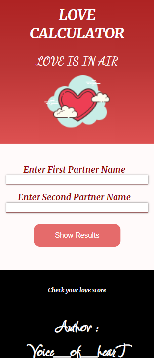

# love_calculator
This is a fun project . Totally based on randomization !!! 

## Table of contents

- [Overview](#overview)
- [Screenshot](#screenshot)
- [Links](#links)
- [My process](#my-process)
- [Built with](#built-with)
- [What I learned](#what-i-learned)
- [Continued development](#continued-development)
- [Useful resources](#useful-resources)
- [Author](#author)

## Overview
Love Calculator : Based on Randomization , calculate love score in percentage ( % ) & get the message.

### Screenshot
## desktop

## mobile


### Links

- Solution URL: [https://github.com/mansi05041/love_calculator]
- Live Site URL: [https://love-calculator-amber.vercel.app/]

## My process

To make website i used randomization to calculate love score .

### Built with

- Semantic HTML5 markup
- CSS custom properties
- Javascript
- Mobile-first workflow

### What I learned

```js
  else{
    //formula of love score
    var num = Math.floor(Math.random()*100)+1;
    document.querySelector(".percentage").innerHTML = num;
    if (num>=80){
     sentence.innerHTML = "made for each other";
    }
    else if (num<80 && num>=60){
      sentence.innerHTML = "Love each other to make it 100%";
    }
    else if (num<60 && num>=30){
      sentence.innerHTML = "Try harder!!!";
    }
    else{
      sentence.innerHTML = "Bad Luck in Love life";
    }
  }

```
Formula to calculate love score.

### Continued development

Improvement in Responsive Area

### Useful resources

- [w3schools](https://www.w3schools.com/css/css_rwd_mediaqueries.asp) - This helped me for understanding the media querry.
- [MDN](https://developer.mozilla.org/en-US/) - This is helpful in implementation of javascript.

## Author

- Frontend Mentor - [@mansi05041](https://www.frontendmentor.io/profile/mansi05041)
- Linkedin - [mansi joshi](https://www.linkedin.com/in/mansi-joshi-663aa81a0/)
